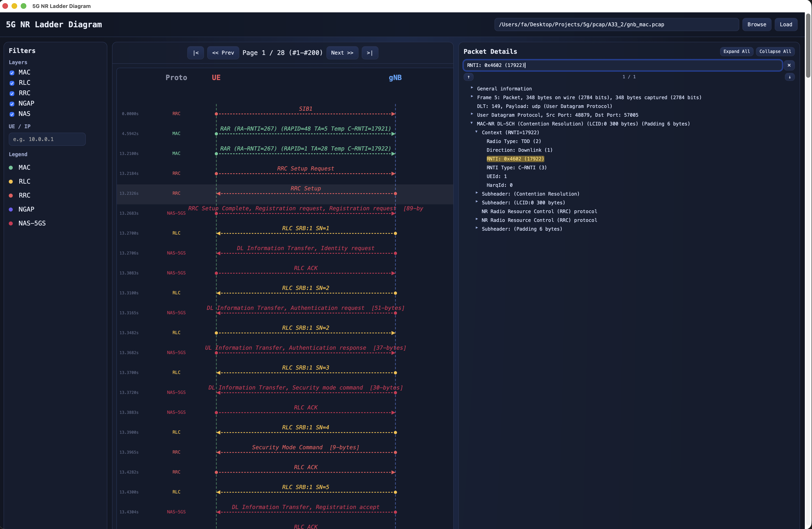

# 5G NR Ladder Diagram Viewer

A desktop application for visualizing 5G NR (New Radio) protocol traces as an interactive ladder diagram. Built with [Tauri](https://tauri.app/) (Rust backend + HTML/JS frontend) and uses Wireshark's `tshark` for deep protocol decoding.



## Features

- **Load PCAP files** — Browse or enter a file path directly
- **Ladder Diagram** — Visualizes UE ↔ gNB message exchanges over time
- **Protocol Layers** — Color-coded by layer: MAC, RLC, RRC, NGAP, NAS-5GS
- **Filtering** — Filter by protocol layer or UE/IP address
- **Click for Details** — Click any message to see the full Wireshark-like protocol tree
- **Packet Details Search** — Search fields in the protocol tree with autocomplete and match navigation
- **Pagination** — Navigate through large captures with page controls

## Requirements

- **macOS** (tested; may work on Linux with path adjustments)
- **Wireshark** (provides `tshark`)
- **Rust toolchain** — install via [rustup](https://rustup.rs/)
- **Node.js + npm** — install via [Homebrew](https://brew.sh/): `brew install node`

`tshark` is discovered automatically in this order:
1. `TSHARK_BIN` environment variable
2. `/Applications/Wireshark.app/Contents/MacOS/tshark`
3. `/opt/homebrew/bin/tshark`
4. `/usr/local/bin/tshark`
5. `/usr/bin/tshark`
6. Any `tshark` in `PATH`

## Setup

```bash
git clone <repo>
cd gnbpcap
npm install
```

## Development

```bash
PATH="/opt/homebrew/bin:$HOME/.cargo/bin:$PATH" npm run tauri:dev
```

The desktop window opens directly via Tauri WebView.

## Build

```bash
PATH="/opt/homebrew/bin:$HOME/.cargo/bin:$PATH" npm run tauri:build
```

## Project Structure

```
gnbpcap/
├── src-tauri/              # Rust backend
│   ├── src/main.rs         # Tauri commands: parse_pcap, get_packet_details
│   ├── Cargo.toml
│   └── tauri.conf.json
├── ui/                     # Frontend (plain HTML/CSS/JS)
│   ├── index.html
│   ├── main.js             # Ladder diagram, canvas rendering, Tauri invoke calls
│   └── styles.css
├── SPEC.md                 # Original specification
├── CLAUDE.md               # AI coding assistant context (Claude Code / opencode)
├── package.json
└── README.md
```

## Supported Protocols

| Layer | Color | Description |
|-------|-------|-------------|
| MAC | Teal `#4ecca3` | MAC-NR scheduling, BSR, PHR |
| RLC | Amber `#ffc857` | RLC-NR ACK/SRBs/DRBs |
| RRC | Red `#ff6b6b` | Radio Resource Control |
| NGAP | Purple `#7b68ee` | NG Application Protocol (gNB ↔ AMF) |
| NAS | Pink `#e94560` | NAS-5GS (Registration, PDU Session) |

## Technical Details

- **Frontend**: Plain HTML/CSS/JS rendered by Tauri's WebView
- **Backend**: Rust — spawns `tshark` via `std::process::Command`, parses PDML XML with `xmltree`
- **Packet list**: `tshark -T fields` with score-based decode profile auto-selection
- **Detail tree**: `tshark -T pdml` parsed into a recursive `TreeNode` structure
- **Rendering**: HTML5 Canvas for the ladder diagram

## Troubleshooting

### Window is blank / canvas not showing
Hard-refresh the WebView: open the developer tools and force reload.

### No packets decoded
- Confirm the PCAP contains 5G NR traffic
- Test manually: `tshark -r yourfile.pcap -c 10`
- The app tries four decode profiles automatically and picks the one with the most meaningful packets

### tshark not found
Install Wireshark from [wireshark.org](https://www.wireshark.org/) or set `TSHARK_BIN=/path/to/tshark` before running.
