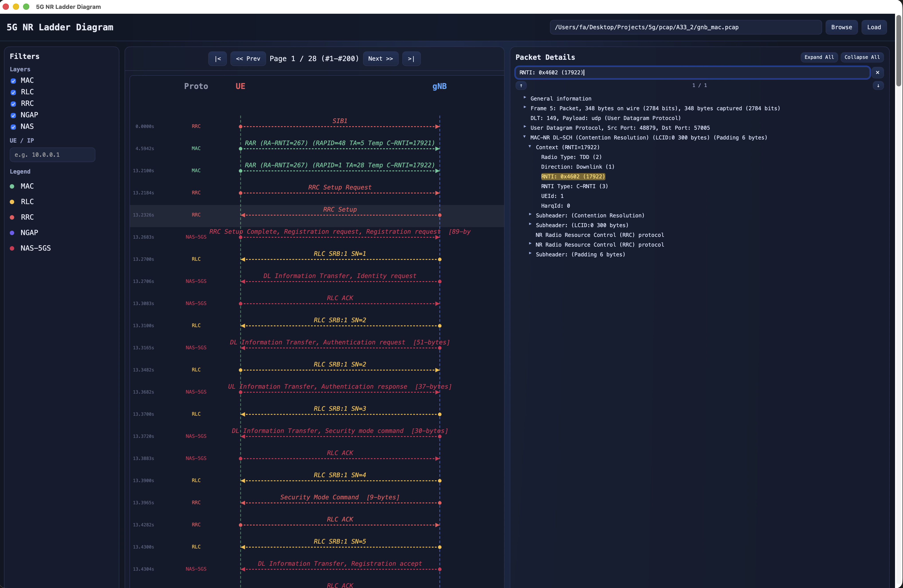

# 5G NR Ladder Diagram Viewer

A desktop application for visualizing 5G NR (New Radio) protocol traces as an interactive ladder diagram. Built with [Tauri](https://tauri.app/) (Rust backend + HTML/JS frontend) and uses Wireshark's `tshark` for deep protocol decoding.



## Features

- **Load PCAP files** — Browse or enter a file path directly
- **Ladder Diagram** — Visualizes UE ↔ gNB message exchanges over time
- **Protocol Layers** — Color-coded by layer: MAC, RLC, RRC, NGAP, NAS-5GS
- **Filtering** — Filter by protocol layer or UE/IP address
- **Click for Details** — Click any message to see the full Wireshark-like protocol tree
- **Packet Details Search** — Search fields in the protocol tree with autocomplete and match navigation
- **Pagination** — Navigate through large captures with page controls

## Requirements

- **Wireshark** (provides `tshark`)
- **Rust toolchain** — install via [rustup](https://rustup.rs/)
- **Node.js + npm**

`tshark` is discovered automatically in this order:
1. `TSHARK_BIN` environment variable
2. `/Applications/Wireshark.app/Contents/MacOS/tshark` (macOS)
3. `/opt/homebrew/bin/tshark`
4. `/usr/local/bin/tshark`
5. `/usr/bin/tshark` (default location on Ubuntu/Debian)
6. Any `tshark` in `PATH`

macOS is the primary, tested platform. Ubuntu and Windows steps below are
documented from each platform's standard toolchain requirements but have
not been built/run end-to-end for this project — if something's off,
please open an issue.

## Setup

### macOS

```bash
brew install node wireshark
git clone <repo>
cd gnbpcap
npm install
```

### Ubuntu / Debian Linux

Tauri needs a handful of system libraries beyond Rust/Node — install them
along with `tshark`:

```bash
sudo apt update
sudo apt install -y tshark libwebkit2gtk-4.0-dev build-essential curl wget \
  file libssl-dev libgtk-3-dev libayatana-appindicator3-dev librsvg2-dev
curl --proto '=https' --tlsv1.2 -sSf https://sh.rustup.rs | sh
```

Install Node.js (Ubuntu's default `apt` package is often outdated — either
use [nvm](https://github.com/nvm-sh/nvm) for a current version, or the
distro package if it's new enough):

```bash
sudo apt install -y nodejs npm
```

Then clone and install as usual:

```bash
git clone <repo>
cd gnbpcap
npm install
```

The `tshark` install prompts about allowing non-root packet capture —
answer either way, since gnbpcap only ever reads existing `.pcap` files,
never captures live traffic.

### Windows

1. Install Rust via [rustup](https://rustup.rs/) (`rustup-init.exe`), plus
   the **Microsoft C++ Build Tools** (Visual Studio Build Tools, with the
   "Desktop development with C++" workload) — Tauri needs the MSVC linker.
2. Install [Node.js](https://nodejs.org/) (official Windows installer).
3. Install [Wireshark](https://www.wireshark.org/) (official Windows
   installer). Auto-discovery doesn't cover Windows paths yet, so set
   `TSHARK_BIN` explicitly, typically:
   ```
   C:\Program Files\Wireshark\tshark.exe
   ```
   (forward slashes also work: `C:/Program Files/Wireshark/tshark.exe`)
4. WebView2 (Tauri's Windows renderer) ships with Windows 10/11 by
   default; if missing, install the
   [Evergreen Bootstrapper](https://developer.microsoft.com/microsoft-edge/webview2/).

```powershell
git clone <repo>
cd gnbpcap
npm install
```

## Development

macOS (Homebrew's paths aren't on `PATH` by default for GUI-launched
processes, so they're prefixed explicitly):

```bash
PATH="/opt/homebrew/bin:$HOME/.cargo/bin:$PATH" npm run tauri:dev
```

Ubuntu/Linux and Windows (rustup/Node installers already put both on
`PATH`):

```bash
npm run tauri:dev
```

The desktop window opens directly via Tauri WebView.

## Build

macOS:

```bash
PATH="/opt/homebrew/bin:$HOME/.cargo/bin:$PATH" npm run tauri:build
```

Ubuntu/Linux and Windows:

```bash
npm run tauri:build
```

## Claude Desktop Integration (MCP)

Besides the Tauri GUI, gnbpcap's PCAP parsing is also available directly in
[Claude Desktop](https://claude.ai/download) chat via an MCP (Model Context
Protocol) server — no need to open the desktop app to ask questions about a
capture.

### 1. Build the CLI binary

```bash
cargo build --release -p gnbpcap-cli
```

### 2. Install the MCP server's Python dependencies

```bash
pip install -r mcp-server/requirements.txt
```

### 3. Register the server

Add this to `claude_desktop_config.json`'s `mcpServers` object:

- macOS: `~/Library/Application Support/Claude/claude_desktop_config.json`
- Windows: `%APPDATA%\Claude\claude_desktop_config.json`

(Claude Desktop doesn't have an official Linux release; on Ubuntu, use
`gnbpcap-cli`/`mcp-server` with Claude Code or another MCP-capable client
instead.)

```json
{
  "mcpServers": {
    "gnbpcap": {
      "command": "python3",
      "args": ["/absolute/path/to/gnbpcap/mcp-server/server.py"],
      "env": {
        "GNBPCAP_CLI_BIN": "/absolute/path/to/gnbpcap/target/release/gnbpcap-cli"
      }
    }
  }
}
```

`GNBPCAP_CLI_BIN` is optional — if unset, the server looks for
`target/{release,debug}/gnbpcap-cli` relative to the workspace root
automatically.

**Fully quit and reopen Claude Desktop** (the config is only read at
startup) — the server needs to be restarted the same way after any future
`gnbpcap-cli`/`server.py` changes, too.

This exposes three tools in chat:

- **`parse_pcap`** — decode a capture into its packet list, paginated and
  size-capped (with an optional `protocol_filter`) so large captures never
  exceed a single response's size budget
- **`get_packet_details`** — the full decoded protocol tree for one frame,
  with `field_filter`/`node_id`/`max_depth` options to scope into huge
  messages (e.g. RRC UE Capability Information) instead of hitting a
  response-size limit
- **`check_redcap_status`** — automatically finds the UE capability
  exchange and reports 3GPP Release 17 RedCap capability

See [`mcp-server/SETUP.md`](mcp-server/SETUP.md) for full details and
manual verification steps.

## Project Structure

```
gnbpcap/
├── gnbpcap-core/           # Shared Rust parsing logic (no Tauri deps)
│   └── src/lib.rs          # tshark invocation, decode-profile scoring, PDML tree building
├── gnbpcap-cli/            # Thin CLI shim over gnbpcap-core, JSON on stdout
│   └── src/main.rs         # Only consumer is mcp-server/server.py
├── src-tauri/              # Rust backend (Tauri app)
│   ├── src/main.rs         # Tauri commands: parse_pcap, get_packet_details — delegates to gnbpcap-core
│   ├── Cargo.toml
│   └── tauri.conf.json
├── mcp-server/             # MCP server for Claude Desktop
│   ├── server.py           # parse_pcap, get_packet_details, check_redcap_status tools
│   ├── requirements.txt
│   └── SETUP.md            # Claude Desktop configuration instructions
├── ui/                     # Frontend (plain HTML/CSS/JS)
│   ├── index.html
│   ├── main.js             # Ladder diagram, canvas rendering, Tauri invoke calls
│   └── styles.css
├── Cargo.toml              # Workspace root (gnbpcap-core, gnbpcap-cli, src-tauri)
├── SPEC.md                 # Original specification
├── CLAUDE.md               # AI coding assistant context (Claude Code / opencode)
├── package.json
└── README.md
```

## Supported Protocols

| Layer | Color | Description |
|-------|-------|-------------|
| MAC | Teal `#4ecca3` | MAC-NR scheduling, BSR, PHR |
| RLC | Amber `#ffc857` | RLC-NR ACK/SRBs/DRBs |
| RRC | Red `#ff6b6b` | Radio Resource Control |
| NGAP | Purple `#7b68ee` | NG Application Protocol (gNB ↔ AMF) |
| NAS | Pink `#e94560` | NAS-5GS (Registration, PDU Session) |

## Technical Details

- **Frontend**: Plain HTML/CSS/JS rendered by Tauri's WebView
- **Backend**: Rust — spawns `tshark` via `std::process::Command`, parses PDML XML with `xmltree`
- **Packet list**: `tshark -T fields` with score-based decode profile auto-selection
- **Detail tree**: `tshark -T pdml` parsed into a recursive `TreeNode` structure
- **Rendering**: HTML5 Canvas for the ladder diagram

## Troubleshooting

### Window is blank / canvas not showing
Hard-refresh the WebView: open the developer tools and force reload.

### No packets decoded
- Confirm the PCAP contains 5G NR traffic
- Test manually: `tshark -r yourfile.pcap -c 10`
- The app tries four decode profiles automatically and picks the one with the most meaningful packets

### tshark not found
Install Wireshark from [wireshark.org](https://www.wireshark.org/) or set `TSHARK_BIN=/path/to/tshark` before running.
